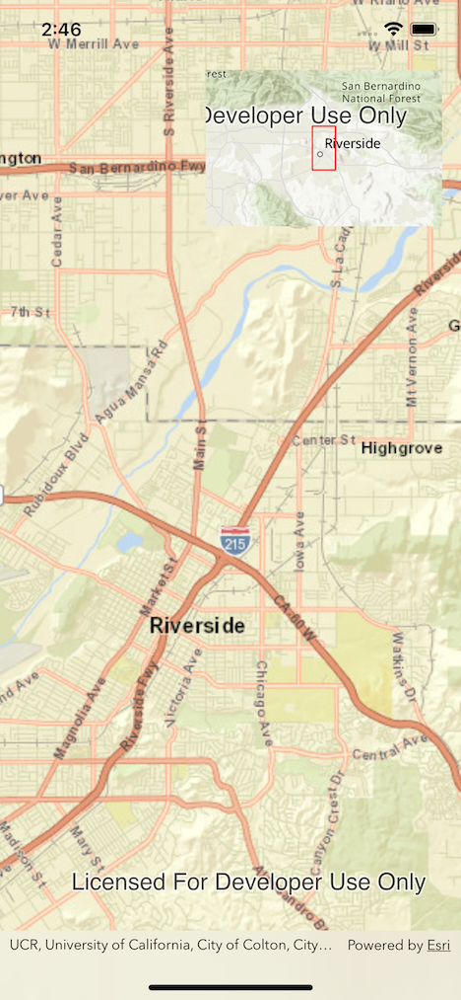
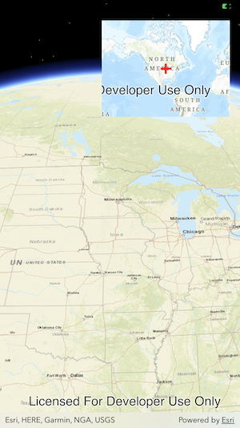

# OverviewMap

`OverviewMap` is a small, secondary `MapView` (sometimes called an inset map), that can be overlaid on an existing `GeoView` (`MapView` or `SceneView`). `OverviewMap` shows a representation of the current `visibleArea` (for a `MapView`) or `viewpoint` (for a `SceneView`).

|MapView|SceneView
|:--:|:--:|
|||


> **NOTE**: OverviewMap uses metered ArcGIS basemaps by default, so you will need to configure an API key. See [Security and authentication documentation](https://developers.arcgis.com/documentation/mapping-apis-and-services/security/#api-keys) for more information.

## Features

OverviewMap:

- Displays a representation of the current `VisibleArea`/`Viewpoint` for a connected `GeoView`.
- Supports a configurable scaling factor for setting the overview map's zoom level relative to the connected view.
- Supports a configurable symbol for visualizing the current `VisibleArea`/`Viewpoint` representation (a `FillSymbol` for a connected `MapView`; a `MarkerSymbol` for a connected `SceneView`).
- Supports using a custom map in the overview map display.

## Key properties

`OverviewMap` has the following instance methods:

- `scaleFactor(_ scaleFactor: Double)` - The scale of the `OverviewMap` relative to the scale of the connected `GeoView`. The `OverviewMap` will display at the a scale equal to: `viewpoint.targetScale` x `scaleFactor`. The default is `25`.
- `symbol(_ symbol: Symbol)` - The symbol used to visualize the current `VisibleArea`/`Viewpoint`. This is a red rectangle by default for a `MapView`; for a `SceneView`, this is a red cross.

## Behavior:

For an `OverviewMap` on a `MapView`, the `MapView`'s `visibleArea` property will be represented in the `OverviewMap` as a polygon, which will rotate as the `MapView` rotates. 

For an `OverviewMap` on a `SceneView`, the center point of the `SceneView`'s `currentViewpoint` property will be represented in the `OverviewMap` by a point. 

## Usage

### Basic usage for overlaying a `MapView`

Note that for a `MapView`, you need to provide the `OverviewMap` both a viewpoint and a polygon representing the visible area.

```swift
@StateObject
var map = Map(basemapStyle: .arcGISImagery)
    
@State
private var viewpoint: Viewpoint?

@State
private var visibleArea: ArcGIS.Polygon?

var body: some View {
    MapView(map: map)
        .onViewpointChanged(kind: .centerAndScale) { viewpoint = $0 }
        .onVisibleAreaChanged { visibleArea = $0 }
        .overlay(
            OverviewMap.forMapView(
                with: viewpoint,
                visibleArea: visibleArea
            )
                .frame(width: 200, height: 132)
                .padding(),
            alignment: .topTrailing
        )
}
```

### Basic usage for overlaying a `SceneView`

Note that for a `SceneView`, you need to provide the `OverviewMap` only a viewpoint.

```swift
@StateObject var scene = Scene(basemapStyle: .arcGISImageryLabels)
    
@State private var viewpoint: Viewpoint?

var body: some View {
    SceneView(scene: scene)
        .onViewpointChanged(type: .centerAndScale) { viewpoint = $0 }
        .overlay(
            OverviewMap.forSceneView(with: viewpoint)
                .frame(width: 200, height: 132)
                .padding(),
            alignment: .topTrailing
        )
}
```

To use a custom map in the `OverviewMap`, use the `map` argument in either `OverviewMap.forMapView` or `OverviewMap.forSceneView`.

To see the `OverviewMap` in action, and for examples of `OverviewMap` customization, check out the [Examples](../../Examples) and refer to [OverviewMapExampleView.swift](../../Examples/Examples/OverviewMapExampleView.swift) in the project.
